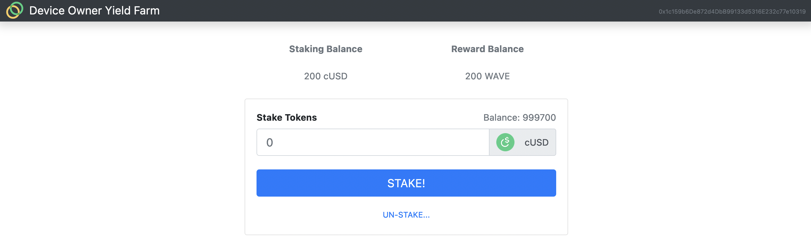

# Yield Farming

## Purpose

## Setup

- `npm install --force` - install all the modules needed to run the dApp
- Install and start [Ganache](https://www.trufflesuite.com/ganache)
- Install and setup [MetaMask](https://metamask.io/)

## Useful commands

- `truffle compile` - compile solidity contracts
- `truffle migrate [--reset]` - migrate solidity contracts. when you redeploy, replace the old contracts
- `truffle console` - interact with javascript runtime environment
- `truffle test` - run test scripts

- `npm run start` - start the local server for the dApp

## User Interface

